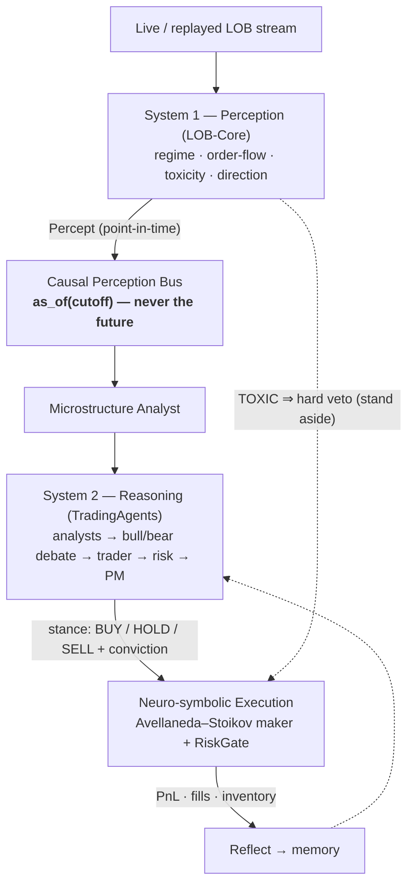

<h1 align="center">Kairos</h1>
<p align="center"><b>The AURA dual-process trading brain</b><br>
<i>System-1 microstructure perception fused with System-2 multi-agent reasoning — under a strict no-look-ahead guarantee.</i></p>

<p align="center">
  
  
  
  
  
</p>

---

> *"Kairos"* (καιρός) — the qualitative, opportune moment to act, as opposed to *chronos*, mere quantitative time. A regime-aware, causally-grounded trader seeks exactly that moment.

Kairos joins two systems that mirror the two systems of a human mind (Kahneman):

| | System 1 — **Perception** | System 2 — **Reasoning** |
|---|---|---|
| module | `kairos.perception` (LOB-Core) | `kairos.reasoning` (TradingAgents) |
| speed | fast, subsymbolic | slow, deliberative |
| does | reads the **limit order book**: regime (RANGE/TREND/TOXIC), order flow, liquidity toxicity — self-supervised, label-free | a **multi-agent LLM firm** debates a decision: analysts → bull/bear → trader → risk → portfolio manager |
| motto | *"Don't predict, understand."* | *"Deliberate over fallible evidence."* |

They are joined by the **Bridge** (`kairos.bridge`) — a **Causal Perception Bus** that lets System-2 read System-1 only through a point-in-time cutoff, plus a neuro-symbolic execution link where System-2 sets the stance and **System-1 can veto it**.



## Why this exists: closing the look-ahead hole

Agentic backtests routinely leak the future. An agent reasoning "as of 2024-05-10" calls a data vendor that quietly returns revised fundamentals, forward-adjusted prices, or "latest" news — and the backtest inflates. Kairos closes this **by construction**, not by review:

- Every microstructure reading is a timestamped `Percept` on an append-only, monotonic **`CausalPerceptionBus`**.
- The **only** way System-2 reads perception is `as_of(cutoff)` — a `bisect` that can reach **only** percepts with `ts ≤ cutoff`.
- Two invariants, **property-tested**: *no future access* and *append-independence* (recording future percepts never changes a past query).
- A **clock-domain guard** refuses a date query against a step-index-clocked bus (which would otherwise return the newest percept) with `ClockDomainError`.

If perception can only be read through this bus, look-ahead is *impossible*, not merely *unlikely*. See **[docs/CAUSALITY.md](docs/CAUSALITY.md)**.

## Quickstart

```bash
git clone <this-repo> kairos && cd kairos
make install          # core only — no LLM, no MLX, no API keys
make gate             # soul_check + core tests + loop smoke  (all green)

kairos loop --scenario toxic     # run perceive → reason → act → reflect
```

A run prints an honest reflection:

```
Kairos cognitive loop — BTCUSDT (scenario=toxic, mode=deterministic)
  System-1 percept : TREND / BULL (conf 100%, tox 0.10)
  System-2 stance  : BUY @ conviction 0.67 (source=deterministic-policy)
  Execution        : PnL +464.5, 207 fills, inv +7.59, halted=False
  System-1 veto    : 28% of the window perceived TOXIC (dominated=False)
  Edge vs stand-aside: +1547.7
  Baselines        : stand_aside=-1083, naive_long=+1032, pure_market_making=-1083
```

Install more when you need it:

```bash
pip install -e ".[reasoning]"   # System-2: the real multi-agent LLM debate
pip install -e ".[mlx]"         # System-1 training on Apple Silicon (inference has a numpy fallback)
pip install -e ".[native]"      # the C++ zero-copy ring
```

The real dual-process debate (needs an LLM key), with the causal bus attached:

```python
from kairos.bridge import build_causal_bus
from kairos.reasoning.graph.trading_graph import TradingAgentsGraph

bus = build_causal_bus(order_book_df, "BTCUSDT")          # epoch-stamped percepts
ta = TradingAgentsGraph(selected_analysts=("microstructure", "market", "news", "fundamentals"))
final_state, decision = ta.propagate("BTCUSDT", "2024-05-10",
                                     asset_type="crypto", perception_bus=bus)
```

## Honest results

Kairos is a **risk-aware, regime-adaptive** system, not a money printer. Measured on synthetic scenarios with the deterministic policy (`scripts/reproduce.py`):

| claim | result |
|---|---|
| No look-ahead leak (any cutoff, any appended future) | ✅ proven by construction + property tests |
| Cognitive loop is bit-deterministic | ✅ |
| System-1 veto: a forced-TOXIC market → **zero fills** | ✅ stand-aside |
| **Benign (range) market: beats naive-always-long** | ✅ 5/5 seeds (spread capture ≈ +850 vs ≈ +80) |
| Stance is regime-adaptive (BUY / HOLD / SELL all occur) | ✅ |

**What we do *not* claim:** on trending/toxic markets, naive directional exposure often wins — a market maker pays adverse selection there, which is a property of the market, not a bug. The value of Kairos is *causal safety and regime-adaptivity*, demonstrable in benign markets and in the System-1 veto.

## The three layers

- **System 1 — `kairos.perception`** (LOB-Core). Self-supervised (masked-LOB + VICReg, negative-free) embedder over L2 order-book snapshots; label-free KMeans regimes RANGE/TREND/TOXIC (evaluation-only, never a training target); Avellaneda–Stoikov maker, risk gate, causal backtester; C++ lock-free SPSC ring with zero-copy pybind11 to the model. MLX to train (Apple Silicon), numpy to infer (everywhere).
- **System 2 — `kairos.reasoning`** (TradingAgents). A LangGraph firm of LLM agents: market / news / sentiment / fundamentals analysts, a bull/bear research debate, a trader, a risk debate, and a portfolio manager. Multi-provider (OpenAI, Anthropic, Google, …).
- **The Bridge — `kairos.bridge`**. `Percept`, `CausalPerceptionBus`, the Microstructure Analyst + tools, and the `ExecutionLink`. This is the novel contribution.

## The Constitution (scoped)

`scripts/soul_check.py` enforces inviolable rules — but *scoped*, because the two systems have different souls:

- **System-1 (engine + bridge):** no classic price-lagged TA (RSI/MACD/EMA…), no `memcpy` on the hot path, no REST in the execution path, no supervised regime labels.
- **System-2 (reasoning):** *exempt* from the no-TA rule — an LLM may legitimately reason about RSI/MACD as fallible evidence.
- **Rule 5 (Causality, new):** the reasoning-facing bridge may read perception only through the causal accessors — never `.latest` / `._percepts`.

## Repository layout

```
src/kairos/
  perception/      System 1 — LOB-Core (schema, synthetic, models, regime, strategy, execution, ingest, web)
  reasoning/       System 2 — TradingAgents (agents, dataflows, graph, llm_clients)
  bridge/          THE BRIDGE — percept, causal_bus, microstructure(+tools/analyst), execution_link
  loop/            cognitive_loop — perceive → reason → act → reflect
  cli.py           unified `kairos` CLI
src/cpp, src/bindings   C++ zero-copy ring
scripts/           soul_check.py (Constitution), reproduce.py (honest gate), build_cpp.sh
docs/              ARCHITECTURE · PHILOSOPHY · CAUSALITY · HOW_IT_WORKS
tests/             bridge · loop · perception · reasoning (592 tests)
```

## Documentation

- **[ARCHITECTURE.md](docs/ARCHITECTURE.md)** — module map, data flow, graph wiring.
- **[PHILOSOPHY.md](docs/PHILOSOPHY.md)** — the dual-process thesis and the two souls.
- **[CAUSALITY.md](docs/CAUSALITY.md)** — how look-ahead is closed by construction *(start here)*.
- **[HOW_IT_WORKS.md](docs/HOW_IT_WORKS.md)** — hands-on walkthrough.

## License & attribution

Proprietary umbrella (© 2026 cleoanka) over the original perception engine, causal bridge, cognitive loop, and integration. Bundles **TradingAgents** (© Tauric Research, **Apache-2.0**) under `kairos.reasoning` — see [`NOTICE`](NOTICE) and [`LICENSE-APACHE-2.0.txt`](LICENSE-APACHE-2.0.txt).

> **Disclaimer.** For research. Not financial, investment, or trading advice. Trading carries risk; the authors assume no liability for any loss. Live real-money routing is deliberately refused without explicit operator confirmation and credentials.
