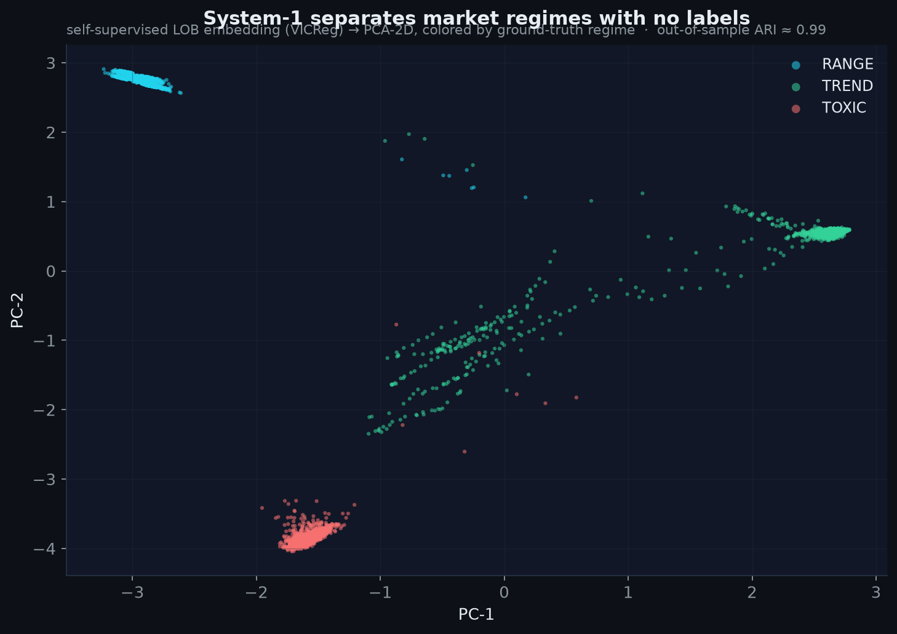
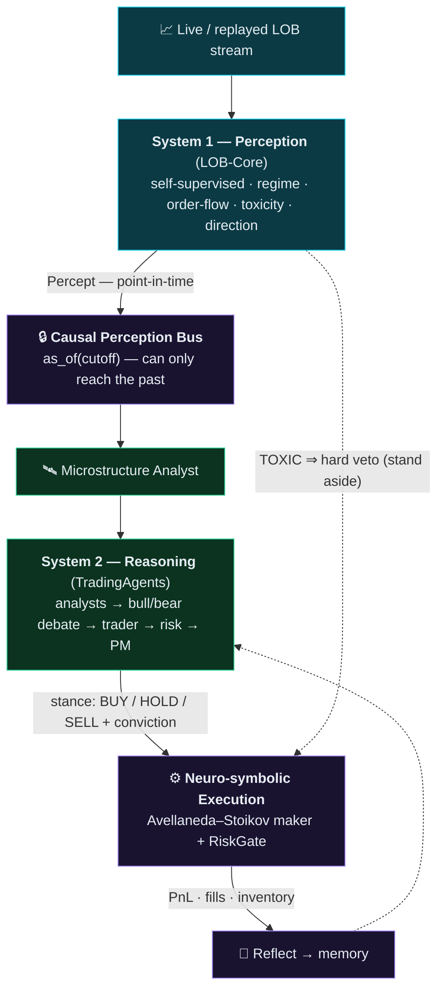
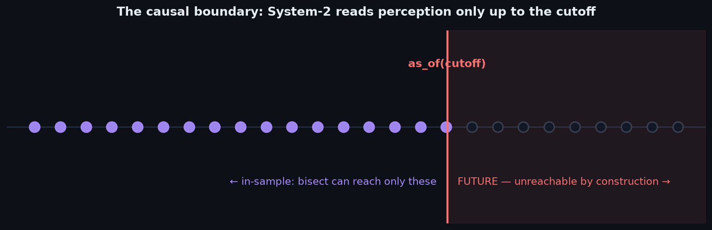
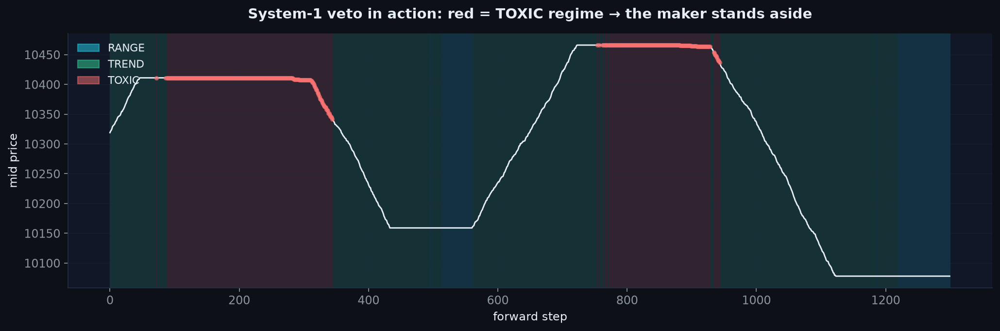
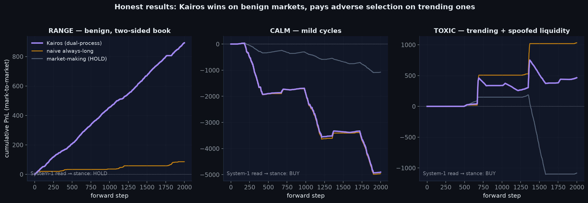

<h1 align="center">⟢ Kairos</h1>
<p align="center"><b>The AURA dual-process trading brain</b></p>
<p align="center"><i>System-1 order-book microstructure perception, fused with System-2 multi-agent LLM reasoning —<br>under a look-ahead guarantee that holds <b>by construction</b>, not by review.</i></p>

<p align="center">
  
  
  
  
  
</p>

<p align="center">
  <a href="#-the-idea">Idea</a> ·
  <a href="#-quickstart">Quickstart</a> ·
  <a href="#-installation">Installation</a> ·
  <a href="#-usage">Usage</a> ·
  <a href="#-how-it-works">How it works</a> ·
  <a href="#-honest-results">Results</a> ·
  <a href="#-documentation">Docs</a>
</p>

---

> *"Kairos"* (καιρός) — the **qualitative, opportune moment** to act, as opposed to *chronos*, mere quantitative time. A regime-aware, causally-grounded trader lives or dies by finding exactly that moment.

## 💡 The idea

A skilled human trader runs on **two minds at once** (Daniel Kahneman, *Thinking, Fast and Slow*):

- **System 1** — fast, intuitive, subsymbolic. The *feel* for the tape: is liquidity real or is someone spoofing? Is flow one-sided? You don't reason your way to this — you've internalized it.
- **System 2** — slow, deliberate, symbolic. The *analysis*: fundamentals, news, competing theses, a debate with yourself before you commit.

Almost every automated system picks **one** and throws away the other:

| approach | has System 1 | has System 2 | the flaw |
|---|:---:|:---:|---|
| pure quant / ML | ✅ | ❌ | no narrative, no reasoning about *why* |
| pure LLM agents | ❌ | ✅ | no feel for the book; and it silently **cheats with future data** |

Kairos keeps **both**, and wires them together the way a mind does:

<p align="center">
  
  <br><em>System 1 is a self-supervised order-book model that learns to tell RANGE, TREND and TOXIC (spoofed) markets apart <b>with no labels</b> — out-of-sample ARI ≈ 0.99.</em>
</p>

The hard part is the **join**. If you let the slow, deliberate System 2 read market data freely, it *cheats*: an agent reasoning "as of 2024-05-10" calls a data vendor that quietly hands back revised fundamentals, forward-adjusted prices, or "latest" news — and your backtest inflates. This look-ahead bias is the quiet killer of agentic backtests.

**Kairos closes that hole by construction** with a *Causal Perception Bus*, and adds a reflex the pure-reasoning systems lack: when System 1 sees the book is toxic, it **vetoes** System 2 — the way you yank your hand off a hot stove *before* you've finished deciding to.



## 🚀 Quickstart

No API keys, no GPU, no market-data account — the whole loop runs on synthetic markets out of the box:

```bash
git clone https://github.com/cleoanka/kairos && cd kairos
make install          # core only (numpy/pandas/sklearn) — portable, no keys
make gate             # soul_check + 100 core tests + loop smoke  → all green

kairos loop --scenario range     # perceive → reason → act → reflect
```

You'll see an **honest** reflection — it reports what happened, including what it stood aside from:

```text
Kairos cognitive loop — BTCUSDT (scenario=range, mode=deterministic)
  System-1 percept : RANGE / NEUTRAL (conf 93%, tox 0.00)
  System-2 stance  : HOLD @ conviction 0.00 (source=deterministic-policy)
  Execution        : PnL +893.1, 895 fills, inv -9.00, halted=False
  System-1 veto    : 0% of the window perceived TOXIC
  Edge vs stand-aside: +0.0
  Baselines        : stand_aside=+893, naive_long=+86, pure_market_making=+893
```

## 📦 Installation

Kairos is **layered**: the core is tiny and portable; heavy or platform-specific pieces are opt-in extras.

| what you install | command | needs |
|---|---|---|
| **Core** — perception inference, causal bridge, execution, the loop (deterministic mode) | `pip install -e .` | Python 3.10+, numpy/pandas/sklearn — **runs everywhere** |
| **`[reasoning]`** — the real System-2 multi-agent LLM debate | `pip install -e ".[reasoning]"` | langchain / langgraph + an LLM API key |
| **`[mlx]`** — train the System-1 encoder | `pip install -e ".[mlx]"` | **Apple Silicon** (inference has a numpy fallback, so this is only for *training*) |
| **`[native]`** — the C++ zero-copy ring | `pip install -e ".[native]"` + `make build-cpp` | a C++20 compiler + cmake |
| **`[viz]`** — charts / dashboards | `pip install -e ".[viz]"` | matplotlib |

Convenience targets:

```bash
make install       # core + dev + viz, into a fresh .venv
make install-all   # + [reasoning] + [native]  (+ [mlx] if on Apple Silicon)
```

> **Why the numpy fallback matters.** The System-1 encoder *trains* in MLX on Apple-Silicon GPUs, but a dependency-free numpy backend reproduces its forward pass to **1.9 × 10⁻⁶** (100 % cluster agreement). So the learned regime read works in CI, on Linux, and inside the reasoning container — training is the only thing pinned to a Mac.

### Optional: keys for the real System-2

Copy `.env.example` → `.env` and fill in whatever you use. Only `kairos reason` and `--mode llm` need an LLM key; everything else runs without one.

```bash
cp .env.example .env      # OPENAI_API_KEY=... (or ANTHROPIC / GOOGLE / …)
```

## 🎛️ Usage

### CLI

```bash
kairos loop  --scenario toxic --mode deterministic   # the cognitive loop (no keys)
kairos loop  --scenario range --learned              # use the trained System-1 encoder
kairos loop  --scenario calm  --json                 # machine-readable output

kairos perceive --mode synthetic                     # System-1 offline PoC: gen → train → cluster (MLX)
kairos perceive backtest --strategy avellaneda       # paper maker backtest
kairos web --live                                    # live regime dashboard (public Bybit WS)

kairos reason NVDA 2024-05-10                         # System-2 decision for a ticker/date (needs [reasoning] + key)

kairos soul-check                                    # the scoped Constitution enforcer
kairos reproduce                                     # honest end-to-end reproducibility gate
```

### Python — the causal bridge

Build a strictly-causal perception history and query it point-in-time:

```python
from kairos.bridge import build_causal_bus

bus = build_causal_bus(order_book_df, "BTCUSDT")   # append-only, monotonic
p = bus.as_of("2024-05-10")        # the most recent percept AT/BEFORE the cutoff — never the future
print(p.regime_name, p.direction, p.toxicity)      # e.g. "TOXIC NEUTRAL 0.71"
```

### Python — one full cognitive cycle

```python
from kairos.loop import run_cognitive_loop, LoopConfig

res = run_cognitive_loop(LoopConfig(scenario="toxic", n_steps=4000, seed=7))
print(res.reflection)              # the human-readable post-mortem
print(res.decision.action, res.execution["final_pnl"], res.baselines)
```

### Python — the real multi-agent debate, grounded by System-1

```python
from kairos.bridge import build_causal_bus
from kairos.reasoning.graph.trading_graph import TradingAgentsGraph

bus = build_causal_bus(order_book_df, "BTCUSDT")   # epoch-stamped percepts
ta  = TradingAgentsGraph(
    selected_analysts=("microstructure", "market", "news", "fundamentals"),
)
final_state, decision = ta.propagate(
    "BTCUSDT", "2024-05-10", asset_type="crypto",
    perception_bus=bus,            # ← the Microstructure Analyst reads this, point-in-time
)
```

## 🔬 How it works

### 1 · System 1 learns the market's *texture*, not its price

`kairos.perception` (the LOB-Core engine) trains a **self-supervised** model on raw L2 order-book snapshots — masked-LOB reconstruction + VICReg, with **no price-direction target ever** ("don't predict, understand"). Label-free clustering then names three regimes:

- **RANGE** — balanced two-sided liquidity; spread is capturable.
- **TREND** — one-sided aggressive flow is eating the book; don't fade it.
- **TOXIC** — displayed liquidity is *phantom* (spoofing / mass cancels); stand aside.

The regime label is **evaluation-only** — it never enters a training loss (Constitution Rule 4). That's what makes the ARI ≈ 0.99 separation above an honest result and not circular.

### 2 · The Causal Perception Bus — closing the look-ahead hole *by construction*

<p align="center">
  
</p>

Each percept is timestamped and dropped on an **append-only, monotonic** bus. The *only* way System 2 reads perception is `as_of(cutoff)` — a `bisect` that can physically reach **only** percepts with `ts ≤ cutoff`. Two invariants, both **property-tested**:

1. **No future access** — every returned percept satisfies `ts ≤ cutoff`.
2. **Append-independence** — recording tomorrow's percepts *never* changes the answer to a query about yesterday.

A **clock-domain guard** goes one step further: querying a synthetic *step-index* bus with a wall-clock *date* would otherwise return the newest percept (maximal leak); Kairos raises `ClockDomainError` instead. Look-ahead isn't *unlikely* here — it's *impossible*, and if perception can only be read through this door (enforced by **Constitution Rule 5**), it stays that way even as the code grows. → **[docs/CAUSALITY.md](docs/CAUSALITY.md)**

### 3 · The neuro-symbolic execution link — and the veto

System 2 emits a *stance* (BUY / HOLD / SELL + conviction). System 1 *executes* it with an Avellaneda–Stoikov market maker sized by that conviction — **but keeps a hard veto**: in a TOXIC regime it stands aside no matter how convinced the debate was. Fast reflex overrides slow deliberation.

<p align="center">
  
  <br><em>Every red band is a TOXIC regime the maker perceived <b>causally, per step</b> — and stood aside from. Notice they cluster exactly on the price plateaus where a naive maker gets picked off.</em>
</p>

## 📊 Honest results

Kairos is a **risk-aware, regime-adaptive** system — not a money printer, and it doesn't pretend to be.

<p align="center">
  
</p>

| claim | result |
|---|---|
| No look-ahead leak (any cutoff, any appended future) | ✅ proven by construction + property tests |
| Cognitive loop is bit-deterministic | ✅ |
| System-1 veto: a forced-TOXIC market → **zero fills** | ✅ stands aside |
| **Benign (RANGE) market: beats naive-always-long** | ✅ **5/5 seeds** (spread capture ≈ +850 vs ≈ +80) |
| Stance is regime-adaptive (BUY / HOLD / SELL all occur) | ✅ |

**What Kairos does _not_ claim.** On trending / toxic markets, naive directional exposure often *wins* — a market maker pays adverse selection there, which is a **property of the market, not a bug**. The value here is *causal safety* and *regime-adaptivity*, provable in benign markets and in the veto. `scripts/reproduce.py` asserts only what is robustly true across seeds — never profit in every regime.

> Every figure above is generated by `scripts/make_readme_figures.py` from the actual system — no mock-ups.

## 🧭 The three layers

- **System 1 — `kairos.perception`** (LOB-Core). Self-supervised (masked-LOB + VICReg) embedder over L2 snapshots; label-free KMeans regimes; Avellaneda–Stoikov maker + risk gate + causal backtester; a C++ lock-free SPSC ring with zero-copy pybind11 to the model. MLX to train, numpy to infer.
- **System 2 — `kairos.reasoning`** (TradingAgents). A LangGraph firm of LLM agents: market / news / sentiment / fundamentals analysts → a bull/bear research debate → a trader → a risk debate → a portfolio manager. Multi-provider (OpenAI, Anthropic, Google, …).
- **The Bridge — `kairos.bridge`**. `Percept`, `CausalPerceptionBus`, the **Microstructure Analyst** + its tools, and the `ExecutionLink`. This is the novel contribution.

## 📜 The Constitution (scoped)

`scripts/soul_check.py` enforces inviolable rules — but **scoped**, because the two systems have deliberately different souls:

- **System 1 (engine + bridge)** — no classic price-lagged TA (RSI/MACD/EMA…), no `memcpy` on the hot path, no REST in the execution path, no supervised regime labels.
- **System 2 (reasoning)** — *exempt* from the no-TA rule; an LLM may legitimately reason about RSI/MACD as fallible evidence.
- **Rule 5 (Causality, new)** — the reasoning-facing bridge may read perception *only* through the causal accessors — never `.latest` / `._percepts`.

CI runs `soul_check` on every push; a violation fails the build.

## 🗂️ Repository layout

```
src/kairos/
  perception/    System 1 — LOB-Core (schema, synthetic, models, regime, strategy, execution, ingest, web)
  reasoning/     System 2 — TradingAgents (agents, dataflows, graph, llm_clients)
  bridge/        THE BRIDGE — percept · causal_bus · microstructure(+tools/analyst) · execution_link
  loop/          cognitive_loop — perceive → reason → act → reflect
  cli.py         the unified `kairos` command
src/cpp, src/bindings   C++ zero-copy ring
scripts/         soul_check.py · reproduce.py · make_readme_figures.py · build_cpp.sh
docs/            ARCHITECTURE · PHILOSOPHY · CAUSALITY · HOW_IT_WORKS  (+ images/)
tests/           bridge · loop · perception · reasoning   (592 tests)
```

## 📚 Documentation

| doc | what's inside |
|---|---|
| **[CAUSALITY.md](docs/CAUSALITY.md)** | how look-ahead is closed by construction — **start here** |
| [ARCHITECTURE.md](docs/ARCHITECTURE.md) | module map, data flow, the graph wiring |
| [PHILOSOPHY.md](docs/PHILOSOPHY.md) | the dual-process thesis and the two souls |
| [HOW_IT_WORKS.md](docs/HOW_IT_WORKS.md) | a hands-on, code-first walkthrough |

## ⚖️ License & attribution

Source-available umbrella (© 2026 cleoanka): the original perception engine, causal bridge, cognitive loop, and integration are proprietary — see [`LICENSE`](LICENSE). Bundles **TradingAgents** (© Tauric Research, **Apache-2.0**) under `kairos.reasoning` — see [`NOTICE`](NOTICE) and [`LICENSE-APACHE-2.0.txt`](LICENSE-APACHE-2.0.txt).

> **Disclaimer.** For research. **Not** financial, investment, or trading advice. Trading carries risk; the authors assume no liability for any loss. Live real-money routing is deliberately refused without explicit operator confirmation and credentials.

<p align="center"><sub>Kairos — where a fast eye for the book meets a slow mind for the thesis, and neither is allowed to see the future.</sub></p>
