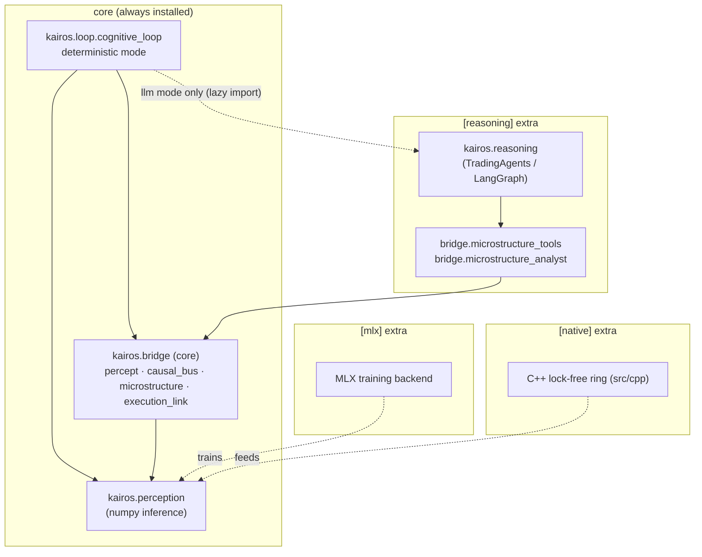
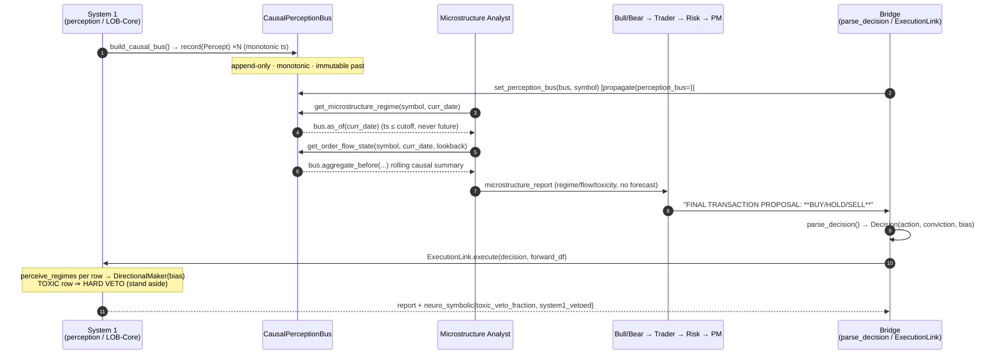
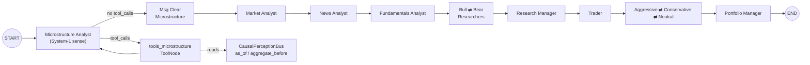

# Kairos Architecture

Kairos is a dual-process trading brain. Two pre-existing systems — a
self-supervised limit-order-book perception engine (**System 1**, LOB-Core) and
a multi-agent LLM trading firm (**System 2**, TradingAgents) — are fused by a
**Bridge** that joins them *causally*, so System 2 can only ever read System 1's
perception through a strict point-in-time cutoff. That cutoff is not a
convention: it is enforced by construction in `CausalPerceptionBus`.

The package docstring (`src/kairos/__init__.py`) states the thesis directly:

> System-2 reads System-1 only through a point-in-time cutoff — closing the
> look-ahead hole by construction — plus a neuro-symbolic execution link where
> System-2 sets the stance and System-1 executes it and can veto it.

The whole system runs as one function loop: **perceive → reason → act →
reflect** (`kairos.loop.cognitive_loop.run_cognitive_loop`).

---

## 1. Package layout under `src/kairos`

```
src/kairos/
├── __init__.py            # thesis + __version__ = "1.0.0"
├── cli.py                 # entrypoint: kairos loop|perceive|reason|web|soul-check|reproduce
│
├── perception/            # SYSTEM 1 — LOB-Core (self-supervised microstructure)
│   ├── schema.py          #   Regime enum, REGIME_NAMES, N_LEVELS, column_names, featurize
│   ├── synthetic/         #   generate() synthetic sessions (toxic/calm/range scenarios)
│   ├── regime/            #   RegimePredictor (VICReg encoder + label-free KMeans)
│   ├── models/            #   embedder.embed (MLX training / numpy inference)
│   ├── strategy/          #   AvellanedaStoikovMaker, Quote, maker overlays
│   ├── execution/         #   run_backtest (simulator), RiskGate (risk)
│   ├── ingest/ · stream.py · real.py · bench.py · tui/ · web/  # feeds, TUI, dashboard
│   └── cli.py             #   perception subcommands (gen/train/cluster/backtest/web/...)
│
├── bridge/                # THE NOVEL CORE — the causal seam between the two systems
│   ├── percept.py         #   Percept (immutable, point-in-time System-1 read)
│   ├── causal_bus.py      #   CausalPerceptionBus, to_epoch, build_causal_bus, LookAheadError
│   ├── microstructure.py  #   raw_signals → Percept; heuristic_regime + LearnedRegime
│   ├── microstructure_tools.py    #   LangChain tools reading the bus point-in-time
│   ├── microstructure_analyst.py  #   the new System-2 "Microstructure Analyst" node
│   └── execution_link.py  #   Decision, ExecutionLink, DirectionalMaker, perceive_regimes
│
├── reasoning/             # SYSTEM 2 — TradingAgents (multi-agent LLM firm)
│   ├── agents/            #   analysts, bull/bear researchers, trader, risk debators, PM
│   ├── graph/             #   the LangGraph wiring (see §5)
│   │   ├── setup.py               #   GraphSetup — nodes + edges factory
│   │   ├── analyst_execution.py   #   AnalystNodeSpec registry + build_analyst_execution_plan
│   │   ├── conditional_logic.py   #   ConditionalLogic — should_continue_* routers
│   │   ├── trading_graph.py       #   TradingAgentsGraph — tool nodes + propagate(perception_bus=)
│   │   ├── propagation.py · checkpointer.py · reflection.py · signal_processing.py
│   ├── dataflows/ · llm_clients.py · default_config.py · reporting.py
│
├── reasoning_cli/         # System-2 interactive CLI + static assets
└── loop/
    └── cognitive_loop.py  # THE LOOP — perceive→reason→act→reflect (deterministic | llm)
```

Each layer keeps its own soul, and the Constitution (`scripts/soul_check.py`)
is **scoped** accordingly:

- **System 1 + bridge** — subject to Rules 1/2/3/4: no `memcpy` on the LOB hot
  path, no classic price-lagged TA vocabulary (`rsi`, `macd`, `ema`, ...), no
  REST/HTTP in the execution path (WebSocket/FIX only), no supervised
  regime/direction label as a training target.
- **System 2** — intentionally *exempt* from the no-classic-TA rule; the LLM
  agents *may* reason about RSI/MACD as fallible evidence.
- **Rule 5 (Causality)** — NEW to Kairos. The reasoning-facing bridge files
  (`bridge/microstructure_tools.py`, `bridge/microstructure_analyst.py`) may
  read perception **only** through the causal accessors `as_of` /
  `window_before` / `aggregate_before`. Touching `.latest` / `._percepts` /
  `._ts` there is a violation, because a dated query could then reach a future
  percept — the exact look-ahead hole Kairos exists to close.

---

## 2. Dependency layering (core vs optional extras)

The dependency graph is deliberately shaped so that the entire causal thesis —
perception inference, the bridge, execution, and the loop in `deterministic`
mode — runs with **no LLM, no MLX, no API keys, anywhere including CI**. This is
declared in `pyproject.toml`.

| Extra | Packages (abridged) | Enables |
|---|---|---|
| **core** (always) | `numpy`, `pandas`, `pyarrow`, `scikit-learn`, `rich`, `websockets` | System-1 numpy inference, the causal bridge core, execution, `kairos loop --mode deterministic` |
| `[reasoning]` | `langchain-core/-anthropic/-openai/-google-genai`, `langgraph`, `langgraph-checkpoint-sqlite`, `yfinance`, `stockstats`, `backtrader`, `typer`, ... | System-2 multi-agent debate, `kairos reason`, `kairos loop --mode llm`, the LangChain-facing bridge submodules |
| `[mlx]` | `mlx>=0.18` | System-1 *training* backend on Apple Silicon (inference has a numpy fallback) |
| `[native]` | `pybind11>=2.12` | the zero-copy C++ lock-free ring (`src/cpp`) |
| `[viz]` | `matplotlib` | perception reports / heatmaps / dashboard charts |
| `[bedrock]` | `langchain-aws` | Amazon Bedrock provider for System-2 |
| `[all]` | `kairos[reasoning,native,viz,bedrock]` | everything except the platform-specific MLX training backend |

The layering is enforced in the code, not just the manifest:

- **The bridge core never imports LangChain.** `bridge/__init__.py` exports only
  the LLM-free pieces (`Percept`, `CausalPerceptionBus`, `build_causal_bus`,
  `MicrostructureConfig`, `LearnedRegime`, `Decision`, `ExecutionLink`, ...).
  The two LangChain-facing submodules — `microstructure_tools` and
  `microstructure_analyst` — are imported *only* by the reasoning wiring, so
  `import kairos.bridge` stays lightweight.
- **Lazy factory in the graph.** `GraphSetup._create_microstructure_analyst`
  does `from kairos.bridge.microstructure_analyst import create_microstructure_analyst`
  *inside* the function, so the reasoning graph has no hard bridge dependency
  unless the microstructure analyst is actually selected.
- **Lazy LLM import in the loop.** `cognitive_loop._llm_decision` imports
  `kairos.reasoning.*` only in the `llm` branch, so `deterministic` mode never
  touches the `[reasoning]` extra.



---

## 3. The three layers

### System 1 — Perception (`kairos.perception`, LOB-Core)
Self-supervised, label-free. It reads the limit order book and *understands* its
state rather than predicting price. Its evaluation vocabulary is three regimes
from `perception.schema.Regime`: **RANGE / TREND / TOXIC** (evaluation-only,
never a training target — Constitution Rule 4). Training uses MLX on Apple
Silicon; inference has a numpy fallback everywhere.

### System 2 — Reasoning (`kairos.reasoning`, TradingAgents)
A multi-agent LLM trading firm on LangGraph: analysts (market / news / sentiment
/ fundamentals) → bull/bear research debate → research manager → trader → risk
debate (aggressive / conservative / neutral) → portfolio manager. Its verdict is
free text ending in `FINAL TRANSACTION PROPOSAL: **BUY/HOLD/SELL**`.

### The Bridge (`kairos.bridge`) — the novel core
Joins the two causally. Its pieces:

- **`Percept`** (`percept.py`) — an immutable, `frozen=True, slots=True`
  point-in-time System-1 read: `regime`, `order_flow_imbalance`,
  `depth_imbalance`, `toxicity`, `trade_intensity`, `direction` (BULL/BEAR/
  NEUTRAL), `regime_confidence`. Every field is computable from data at-or-before
  `ts`. `is_toxic` exposes System-1's hard veto; `to_prompt()` renders a compact,
  forecast-free, LLM-facing summary.
- **`CausalPerceptionBus`** (`causal_bus.py`) — append-only, monotonic (`record`
  raises on out-of-order `ts`). The only read path for System-2 is
  `as_of(cutoff)`, a `bisect_right - 1` that can reach only percepts with
  `ts <= cutoff`. Its two invariants: **(1) no future access** (asserted, raising
  `LookAheadError`), **(2) append-independence** (recording future percepts never
  changes a past query). `to_epoch` maps a bare `"YYYY-MM-DD"` to the **close**
  of that day (23:59:59.999999 UTC) — explicitly *not* `datetime.fromisoformat`'s
  midnight, which would reintroduce intraday look-ahead.
- **`microstructure.py`** — `raw_signals(window)` → causal signals →
  `percept_from_window`. Two interchangeable regime backends over one feature
  computation: portable `heuristic_regime`, and `LearnedRegime` (wraps the
  trained VICReg `RegimePredictor` with a softmax-over-centroid-distance
  confidence). A TOXIC book always collapses direction to NEUTRAL/0.
- **`microstructure_tools.py` + `microstructure_analyst.py`** — a NEW System-2
  analyst whose LangChain tools read the bus point-in-time (§4, §5).
- **`execution_link.py`** — neuro-symbolic control. `Decision` is a System-2
  stance (BUY/HOLD/SELL + `conviction` → signed `bias`). `ExecutionLink.execute`
  runs a `DirectionalMaker` (Avellaneda–Stoikov skewed by the bias) over the
  forward window. `perceive_regimes` computes the **perceived** regime per row
  from a trailing causal window — execution acts on that, *never* the
  ground-truth `regime` column. System-1 keeps a HARD VETO: a TOXIC row → no
  quote, regardless of conviction.

---

## 4. How a Percept flows: perception → bus → analyst → debate → execution

A `Percept` is the atom that crosses the seam between the two systems. Its
journey:

1. **Produced (System 1).** `build_causal_bus(df, symbol, window, step)` replays
   a raw LOB DataFrame, emitting one `Percept` every `step` rows via
   `percept_from_window` — each aggregated over a trailing `window` of rows, so
   every percept sees only its own past.
2. **Recorded (Bridge).** Each percept is `bus.record(...)`-ed onto the
   append-only, monotonic `CausalPerceptionBus`.
3. **Attached (Bridge → System 2).** For an LLM run,
   `TradingAgentsGraph.propagate(..., perception_bus=bus)` calls
   `set_perception_bus(bus, symbol=company_name)`, registering the bus in the
   `_BUSES` process-global for that run's tools.
4. **Read point-in-time (System 2).** The **Microstructure Analyst**'s tools —
   `get_microstructure_regime` and `get_order_flow_state` — call `bus.as_of(curr_date)`
   / `bus.aggregate_before(...)`. They read the bus **only** through causal
   accessors (Rule 5). If no percept exists at the cutoff, they say so plainly
   rather than falling back to `.latest` (which would leak the future).
5. **Debated (System 2).** The analyst's `microstructure_report` grounds the
   bull/bear research debate → research manager → trader → risk debate →
   portfolio manager, which emits `FINAL TRANSACTION PROPOSAL: **BUY/HOLD/SELL**`.
6. **Parsed to a stance (Bridge).** `parse_decision(verdict_text)` extracts a
   `Decision(action, conviction)`; `Decision.bias` maps it to a signed lean in
   `[-1, 1]`.
7. **Executed under veto (Bridge → System 1).** `ExecutionLink.execute(decision,
   forward_df)` re-perceives the regime per forward row (`perceive_regimes`),
   drives a `DirectionalMaker` skewed by `decision.bias`, and reports
   `neuro_symbolic` annotations including `toxic_veto_fraction` and
   `system1_vetoed`. In TOXIC rows System-1 wins no matter the conviction.



---

## 5. Graph wiring — adding the Microstructure Analyst to the TradingAgents LangGraph

The new System-1 analyst was grafted into the existing TradingAgents LangGraph
through four coordinated touch-points, all **opt-in** so that a pure-reasoning
run is byte-for-byte unaffected (`microstructure` is *not* in the default
analyst set).

### 5.1 `analyst_execution.py` — the node spec
`ANALYST_NODE_SPECS` is a registry of `AnalystNodeSpec(key, agent_node,
clear_node, tool_node, report_key)`. The microstructure entry:

```python
"microstructure": AnalystNodeSpec(
    key="microstructure",
    agent_node="Microstructure Analyst",
    clear_node="Msg Clear Microstructure",
    tool_node="tools_microstructure",
    report_key="microstructure_report",
),
```

`build_analyst_execution_plan(selected_analysts)` turns the selected keys into an
ordered `AnalystExecutionPlan.specs` list (raising on an unknown key), driving
node creation and the sequential analyst edges. `AnalystWallTimeTracker` /
`sync_analyst_tracker_from_chunk` time each analyst using the same specs.

### 5.2 `conditional_logic.py` — the tool-loop router
`ConditionalLogic.should_continue_microstructure(state)` mirrors the other
analysts: if the last message has `tool_calls`, route to `"tools_microstructure"`;
otherwise route to `"Msg Clear Microstructure"`. `GraphSetup` resolves this by
name via `getattr(conditional_logic, f"should_continue_{spec.key}")`.

### 5.3 `setup.py` — the factory + edges
`GraphSetup.setup_graph` registers a per-key factory dict; the microstructure
entry uses a lazy import so the graph has no hard bridge dependency unless
selected:

```python
"microstructure": lambda: _create_microstructure_analyst(self.quick_thinking_llm),
# _create_microstructure_analyst does:
#   from kairos.bridge.microstructure_analyst import create_microstructure_analyst
```

For every spec in `plan.specs` it adds three nodes — `agent_node`, `clear_node`,
`tool_node` — then wires the analyst loop generically:

```
START ──► specs[0].agent_node
agent_node ──conditional(should_continue_<key>)──► {tool_node, clear_node}
tool_node ──► agent_node                      (loop until no tool_calls)
clear_node ──► next analyst  (or "Bull Researcher" if last)
```

so the microstructure analyst slots into the analyst chain with no special-casing
downstream. After the last analyst, control flows into the unchanged
`Bull Researcher ⇄ Bear Researcher → Research Manager → Trader → Aggressive ⇄
Conservative ⇄ Neutral → Portfolio Manager → END` subgraph.

### 5.4 `trading_graph.py` — the tool node + `propagate(perception_bus=...)`
`TradingAgentsGraph._create_tool_nodes` registers the microstructure `ToolNode`
**unconditionally** (so a saved config selecting the analyst always resolves),
built from `MICROSTRUCTURE_TOOLS`:

```python
from kairos.bridge.microstructure_tools import MICROSTRUCTURE_TOOLS
"microstructure": ToolNode(list(MICROSTRUCTURE_TOOLS)),   # [get_microstructure_regime, get_order_flow_state]
```

The bus is attached **per run** in `propagate(company_name, trade_date,
asset_type, perception_bus=None)`:

```python
if perception_bus is not None:
    from kairos.bridge.microstructure_tools import set_perception_bus
    set_perception_bus(perception_bus, symbol=company_name)
```

so the analyst's tools read System-1 percepts strictly point-in-time as of
`trade_date`. `TradingAgentsGraph.__init__` accepts `selected_analysts` (the
`cognitive_loop._llm_decision` path passes
`("microstructure", "market", "news", "fundamentals")`), and `GraphSetup` +
`ConditionalLogic` are constructed from `self.config` and handed to
`setup_graph(selected_analysts)`.

### 5.5 The Microstructure Analyst node itself
`create_microstructure_analyst(llm)` (`bridge/microstructure_analyst.py`) returns
a LangGraph node closure whose system prompt tells it to read the **order book
itself** (not price/fundamentals/news), interpret RANGE/TREND/TOXIC like a market
maker, treat TOXIC as an explicit stand-aside signal, and never invent a regime
when perception is unavailable. It binds the two causal tools, invokes the chain,
and emits `{"messages": [...], "microstructure_report": ...}` — the `report_key`
the rest of the graph consumes.



---

## 6. The Loop — `kairos.loop.cognitive_loop.run_cognitive_loop`

The loop is the whole thesis as one function. It splits a session into an
in-sample half (`decision_fraction`, default `0.5`) and a forward half; the
decision is formed from in-sample only, execution runs on the forward half — so
look-ahead is impossible by construction and the reported PnL is a faithful
causal shadow, never an inflated backtest.

```mermaid
sequenceDiagram
    autonumber
    participant Loop as run_cognitive_loop
    participant Gen as perception.synthetic.generate
    participant Bus as CausalPerceptionBus
    participant R as Reason backend
    participant Ex as ExecutionLink
    participant Rf as _reflect

    Loop->>Gen: generate(n_steps, seed, scenario)  (or caller df=)
    Loop->>Loop: split df → in_sample[:k] | forward[k:]
    Loop->>Bus: build_causal_bus(in_sample, window, step, regime_backend)
    Note over Loop,Bus: PERCEIVE
    Loop->>Bus: percept = bus.as_of(decision_ts)
    Note over Bus: assert percept.ts ≤ decision_ts  (causal invariant)
    alt mode == "deterministic"
        Loop->>R: deterministic_policy(percept)  (no LLM, no keys)
    else mode == "llm"
        Loop->>R: _llm_decision(bus, symbol, decision_ts)  (real debate, bus attached)
    end
    R-->>Loop: Decision(action, conviction)
    Note over Loop,R: REASON
    Loop->>Ex: ExecutionLink.execute(decision, forward)  [+ baselines]
    Note over Ex: ACT — TOXIC veto per forward row
    Ex-->>Loop: execution report + neuro_symbolic
    Loop->>Rf: _reflect(percept, decision, execution, baselines)
    Note over Rf: REFLECT — edge vs stand-aside / naive_long / pure_market_making
    Rf-->>Loop: LoopResult
```

- **Perceive** — build the causal bus from the in-sample half; take
  `percept = bus.as_of(decision_ts)` at the last in-sample row; assert the causal
  invariant.
- **Reason** — `deterministic` maps the percept to a stance via
  `deterministic_policy` (a transparent, auditable System-2 stand-in that HOLDs on
  TOXIC and otherwise scales conviction by `direction_strength × regime_confidence`);
  `llm` runs `_llm_decision`, which builds a `TradingAgentsGraph` with the
  microstructure analyst selected, calls `propagate(..., perception_bus=bus)`,
  and `parse_decision`s the verdict.
- **Act** — `ExecutionLink.execute` over the forward window; System-1 retains the
  TOXIC veto per row.
- **Reflect** — `_reflect` scores the result against honest baselines
  (`stand_aside`, `naive_long`, `pure_market_making`) and reports the edge, the
  fraction of the window perceived TOXIC, and whether System-1 dominated — so the
  value of each system is measurable, not asserted.

Both modes are exposed via `kairos loop [--scenario ...] [--mode deterministic|llm]
[--learned]`; `--learned` swaps in the trained `LearnedRegime` backend
(`RegimePredictor.load()`). The `deterministic` path (and everything up to it)
needs no keys and no MLX; `--mode llm` and `kairos reason` need the `[reasoning]`
extra.
