# Causality: closing the look-ahead hole *by construction*

> "Don't predict, understand." — and never let the future teach the past.

This is the flagship invariant of Kairos. Every backtest number the system reports
is only trustworthy if System-2 could not have seen the future when it reasoned.
Most agentic backtests cannot make that claim. Kairos can — not because a human
reviewed the code and found no leak, but because the one channel through which
System-2 reads perception, [`CausalPerceptionBus`](../src/kairos/bridge/causal_bus.py),
*cannot physically reach* a percept from the future. This document explains the
problem, the mechanism, and the proofs.

---

## 1. The look-ahead problem in agentic backtests

A multi-agent LLM trading firm (Kairos' System-2, `src/kairos/reasoning/`) reasons
"as of a trade date." Its analysts call tools; its tools call data sources. The
danger is subtle and almost always invisible in the transcript:

> An agent reasoning **as of `2024-05-10`** calls a data vendor for that
> `trade_date`. The vendor quietly returns **revised** fundamentals, **forward-
> adjusted** prices, or a "latest" news snapshot. The future has leaked into a
> decision that is supposed to have been made in the past.

The module docstring of `causal_bus.py` names this exactly: a naive integration
would let an agent "call a data vendor that quietly returns revised fundamentals,
forward-adjusted prices, or 'latest' news — leaking the future into a backtest and
inflating every result. TradingAgents, like most agentic backtests, is exposed to
this."

Three properties make this class of bug pernicious:

1. **It inflates every result.** Look-ahead is a directional bias toward
   optimism; the backtest looks better precisely because it cheated.
2. **It is invisible to review.** The leak lives in the *semantics of a lookup*
   ("give me `trade_date`'s data"), not in any line that obviously says "read the
   future." No amount of reading the agent's reasoning trace reveals it.
3. **It is intraday-silent.** A daily-granularity cutoff that is off by a few
   hours — start-of-day instead of close-of-day — leaks an entire session and
   trips no assertion (see §4).

The lesson Kairos takes from this: **look-ahead safety must be a property of the
access path, not of the caller's discipline.**

---

## 2. The causal boundary

Kairos makes microstructure perception the *only* thing System-2 reads from
System-1, and forces that read through a single, narrow, causal accessor.

```mermaid
flowchart LR
    subgraph S1["System 1 — Perception (label-free LOB engine)"]
        LOB["Raw limit-order-book window"] --> PW["percept_from_window()"]
        PW --> P["Percept<br/>(immutable, timestamped)"]
    end

    subgraph BUS["CausalPerceptionBus — the causal boundary"]
        direction TB
        REC["record(percept)<br/>append-only · monotonic ts"]
        STORE[("_percepts[] + _ts[]<br/>parallel, sorted")]
        REC --> STORE
        ASOF{{"as_of(cutoff)<br/>window_before · aggregate_before<br/>— bisect, ts ≤ cutoff only —"}}
        STORE --> ASOF
    end

    P --> REC

    subgraph S2["System 2 — Reasoning (multi-agent LLM firm)"]
        MT["microstructure_tools.py"] --> MA["microstructure_analyst.py"]
        MA --> DEBATE["bull/bear debate → trader → risk → PM"]
    end

    ASOF -->|"only percepts with ts ≤ cutoff<br/>(Rule 5: no .latest / ._percepts)"| MT

    classDef boundary fill:#12233a,stroke:#4a90d9,color:#e8f0fb,stroke-width:2px;
    class BUS,ASOF boundary;
```



The write side (`record`) and the read side (`as_of` / `window_before` /
`aggregate_before`) are the only two doors. The boundary holds because both doors
are constrained: writes are forward-only, reads are past-only. Everything below is
a detailed reading of those two constraints.

---

## 3. The two invariants

The module docstring states them as guarantees, and both are *asserted at runtime*
(cheaply, gated by `strict`) **and** exhaustively property-tested:

### Invariant 1 — No future access
> *Every percept returned by any query has `ts <= cutoff`.*

The read methods enforce this two ways. First, the bisect (§4) mathematically
cannot select an index whose timestamp exceeds the cutoff. Second, a belt-and-
suspenders runtime check re-verifies it and raises rather than leak:

```python
# as_of(), causal_bus.py
p = self._percepts[idx]
if self._strict and p.ts > cutoff:
    raise LookAheadError(f"as_of returned ts={p.ts} > cutoff={cutoff}")
```

`window_before` carries the identical guard on `out[-1].ts`. `LookAheadError`
subclasses `AssertionError` and, per its docstring, means "an invariant of the bus
was violated — a bug in the bus itself, never a mere data gap." A genuine gap
(nothing recorded at/before the cutoff) is *not* an error: `as_of` returns `None`,
`window_before` returns `[]`, `aggregate_before` returns `None`.

### Invariant 2 — Append-independence
> *Recording later percepts never changes the answer to an earlier `as_of` — the
> past is immutable once observed.*

This is what makes the bus safe to *stream*. New percepts only ever land at the end
(`record` appends), timestamps are non-decreasing (enforced below), and a query for
cutoff `c` bisects into the prefix that already existed when `c` first became
answerable. Appending to the tail cannot move any element at or before `c`, so the
answer is stable. This is the property that structurally defeats "revised data":
even if a *later* percept is a correction, a query about the past never sees it.

The write side is what upholds monotonicity, and it refuses to be fooled:

```python
# record(), causal_bus.py
if self._ts and ts < self._ts[-1]:
    raise ValueError(
        f"out-of-order percept: ts={ts} precedes last recorded ts={self._ts[-1]}. "
        "The causal bus models a forward-only stream."
    )
```

Equal timestamps are allowed (two reads at the same instant); going backwards is
not (a real feed never delivers an older book after a newer one).

---

## 4. The mechanism: bisect + the close-of-day cutoff

### 4.1 The bisect
The bus keeps two parallel lists: `_percepts` and a sorted `_ts`. A query is
answered by one `bisect_right` and a decrement:

```python
# as_of()
cutoff = to_epoch(query)
idx = bisect.bisect_right(self._ts, cutoff) - 1
if idx < 0:
    return None
```

`bisect_right(_ts, cutoff)` returns the insertion point *just past* every element
`<= cutoff`. Subtracting one lands on **the most recent percept at or before the
cutoff** — never after it. If the cutoff precedes the first percept, `idx` is `-1`
and the method returns `None`. Because `_ts` is sorted (guaranteed by `record`'s
monotonicity check), the reachable set is exactly the causal prefix `[0, idx]`; the
future `[idx+1, ...]` is unreachable by arithmetic, not by convention.

`window_before` uses the same `hi = bisect_right(_ts, cutoff)` and slices
`_percepts[max(0, hi-n):hi]` — the up-to-`n` most recent causal percepts, oldest→
newest. `aggregate_before` bisects twice to form the half-open window
`(cutoff - horizon, cutoff]` and summarizes the regime distribution and mean flow
over it. All three share the single causal frontier `hi`.

### 4.2 `to_epoch`: mapping a trade date to the *close* of the day
System-2 reasons at daily granularity: "trade on `2024-05-10`." The correct
point-in-time cutoff for that statement is the **close of `2024-05-10`** — the
whole session is in-sample, and nothing from `2024-05-11` is visible. `to_epoch`
normalizes every query-time form onto the bus clock and, for a bare date, maps to
the last microsecond of the UTC day:

```python
# to_epoch(), for a "YYYY-MM-DD" string
if _DATE_ONLY.match(s):  # "YYYY-MM-DD" -> close of that day, UTC
    d = date.fromisoformat(s)
    return datetime(d.year, d.month, d.day, 23, 59, 59, 999999,
                    tzinfo=timezone.utc).timestamp()
```

The same close-of-day rule applies to a `datetime.date` object. `float`/`int` pass
through (the synthetic / monotonic-index case). Full ISO datetime strings and
`datetime` objects keep their time component; naive datetimes are interpreted as
UTC. Booleans are rejected up front (`bool` is an `int` subclass — an easy footgun).

### 4.3 The Python-3.11 `fromisoformat` midnight bug — and the guard
Here is the subtle, load-bearing detail. On Python 3.11+, `datetime.fromisoformat`
became lenient and **parses a bare date string as midnight**:

```python
datetime.fromisoformat("2024-05-10")  # -> 2024-05-10 00:00:00  (START of day!)
```

If `to_epoch` naively fed `"2024-05-10"` to `datetime.fromisoformat`, the cutoff
would silently become **start-of-day** instead of **close-of-day**. That is not a
crash — it is a *silent* look-ahead inversion:

- The cutoff is now `00:00:00`, so the entire trading session of `2024-05-10`
  falls *after* the cutoff and is excluded.
- Worse, in the general framing, a start-of-day cutoff shifts the whole in-sample
  boundary back by a day, which — depending on how a run's "decide in-sample,
  execute forward" split is wired — reintroduces exactly the intraday leak Kairos
  exists to close. And it trips **no assertion**, because the bus is behaving
  correctly for the (wrong) cutoff it was handed.

Kairos guards against this **explicitly and before** ever calling
`datetime.fromisoformat`. A dedicated regex detects the bare-date shape and routes
it to the deliberate close-of-day construction:

```python
# A bare calendar day, no time component. Detected explicitly BEFORE trying
# datetime.fromisoformat — which on Python 3.11+ parses "2024-05-10" as
# *midnight* (start of day), silently turning a close-of-day cutoff into a
# start-of-day one and reintroducing intraday look-ahead.
_DATE_ONLY = re.compile(r"^\d{4}-\d{2}-\d{2}$")
```

Only strings that *carry a time component* ever reach `datetime.fromisoformat`.
This is a case where a one-line parsing default, left unguarded, would quietly
undermine the system's central claim — so the guard is documented in the code and
proven in the tests (§6, `test_date_string_cutoff_is_close_of_day`).

### 4.4 The mixed-clock hole — and the `ClockDomainError` guard

An adversarial review found a subtler vector. Invariant 1 says every returned
percept has `ts ≤ cutoff` — but that is only meaningful if the *cutoff and the
percepts are denominated on the same clock*. The bus is clock-agnostic: synthetic
/ replay percepts are usually stamped with a monotonic **step index** (0, 8, 16,
…, ~4000), while a real instrument's percepts carry a **UNIX epoch** (~1.7e9).

Now consider `as_of("2024-05-10")` against a *step-index* bus. `to_epoch` faithfully
maps the date to an epoch (~1.7e9), the bisect finds the largest `ts ≤ 1.7e9` — and
since *every* step index (max ~4000) satisfies that, it returns the **newest**
percept: maximal look-ahead. And the `ts ≤ cutoff` assertion does **not** fire,
because `4000 ≤ 1.7e9` is numerically true. The invariant held; the clock lied.

Kairos closes this by giving the bus a **clock domain** and refusing cross-clock
queries. `resolve_cutoff` classifies each query as `numeric` (a raw number / numeric
string — clock-agnostic, "this exact value on whatever clock the bus uses") or
`epoch` (a date/datetime — fixed on the wall-clock). The bus infers its own clock
from the first recorded ts (`infer_clock`: `epoch` if `|ts| ≥ 1e7`, else `index`),
and every read routes through `_cutoff`:

```python
# _cutoff(), causal_bus.py
def _cutoff(self, query) -> float:
    value, domain = resolve_cutoff(query)
    if domain == "epoch" and self._clock == "index":
        raise ClockDomainError(...)   # a date cutoff on step-index percepts would leak
    return value
```

A date query against an index-clocked bus now **raises `ClockDomainError`** (a
subclass of `LookAheadError`) instead of silently returning the tail. Numeric
queries stay clock-agnostic, so a synthetic run queried with a numeric step — or a
stringified number like `"2000.0"` — still works and stays causal. This is the
difference between a guarantee that holds *within* a clock and one that also refuses
to be fooled *across* clocks. Proven in §6
(`test_mixed_clock_query_is_rejected_not_leaked`).

---

## 5. Rule 5 of the Constitution — sealing the boundary

Invariants 1 and 2 only bind System-2 if System-2 reads through the causal doors.
The bus, being a plain object, also exposes non-causal introspection —
`.latest` (the most recent percept regardless of any cutoff), and the raw internals
`._percepts` / `._ts`. Those are legitimate for engine bookkeeping and `__repr__`,
but a *reasoning-facing* tool that touched them could let a dated query reach a
future percept — the exact hole Kairos closes.

So the Constitution (`scripts/soul_check.py`) adds **Rule 5 — CAUSALITY**, which is
new to Kairos and specific to the bridge. From the enforcer's own header:

> **Rule 5 — CAUSALITY (Kairos):** the reasoning-facing bridge (microstructure
> tools + analyst) may read perception **ONLY** through the causal accessors
> `as_of` / `window_before` / `aggregate_before`. Touching `.latest` /
> `._percepts` / `._ts` there would let a dated query reach a future percept — the
> exact look-ahead hole Kairos exists to close. Flagged as a violation.

Its implementation is a scoped static scan: for the two reasoning-facing files
`bridge/microstructure_tools.py` and `bridge/microstructure_analyst.py`, any code
(comments stripped) matching `\.(latest\b|_percepts\b|_ts\b)` is a violation:

```python
# scan_python(), soul_check.py
_NONCAUSAL = re.compile(r"\.(latest\b|_percepts\b|_ts\b)")
_BRIDGE_CAUSAL_FILES = ("bridge/microstructure_tools.py",
                        "bridge/microstructure_analyst.py")
...
if any(relp.endswith(f) for f in _BRIDGE_CAUSAL_FILES):
    for i, ln in enumerate(src.splitlines(), 1):
        code = ln.split("#", 1)[0]
        m = _NONCAUSAL.search(code)
        if m:
            out.append(Violation(5, rel, i, ...))  # non-causal access flagged
```

The constitution is deliberately **scoped** to keep the two souls distinct. Rule 5,
like Rules 1–4, is an *engine-side* rule; the System-2 reasoning subtree
(`src/kairos/reasoning/`) is exempt from the engine's other constraints — e.g. it
*may* reason about RSI/MACD as fallible evidence (that is its design) — but the
narrow strip of bridge code that hands microstructure to System-2 is held to the
causal-access-only standard. Rule 5 is what stops a future contributor from
"just grabbing `.latest`" in a tool and silently unpicking the whole guarantee.

`soul_check.py` exits non-zero on any violation, so this is enforced in CI, not by
memory.

---

## 6. The proofs — `tests/bridge/test_causal_bus.py`

The module docstring of the tests states the stakes plainly: *"If these pass,
look-ahead bias is impossible by construction — every query is proven to reach only
percepts at or before its cutoff, and the answer to a past query is proven
independent of any future percept appended later."* Each test and exactly what it
asserts:

| Test | Proves | Key assertion |
|---|---|---|
| `test_as_of_never_returns_future` | **Invariant 1** across a dense sweep. Records `ts = 0..99`, queries every cutoff in `-5..104`. | For every non-`None` result, `p.ts <= cutoff` — no query ever surfaces the future. |
| `test_as_of_returns_most_recent_at_or_before` | The bisect returns the *correct* causal element, not merely a safe one. | `as_of(4.0).ts == 1.0` (gap between 1 and 5); `as_of(5.0).ts == 5.0` (exact match is in-sample, `<=`); `as_of(100.0).ts == 9.0` (past the end → the last, still causal); `as_of(-1.0) is None` (before the first). |
| `test_append_independence` | **Invariant 2.** Snapshots `as_of` for cutoffs `0..49`, then appends "future" percepts `50..199` and re-queries the same cutoffs. | For every past cutoff `c`, `after.ts == snapshot[c].ts` — appending the future changed no past answer. |
| `test_window_before_is_causal` | `window_before` respects the frontier and preserves order. | For cutoffs incl. `99` and `500`: every `p.ts <= cutoff`, and the window equals itself sorted by `ts` (oldest→newest). |
| `test_aggregate_before_is_causal` | The rolling aggregate window is causal and half-open. | `aggregate_before(80.0, horizon=20.0)` has `cutoff == 80.0` and `n <= 21` (window `(60, 80]`); an empty span (`aggregate_before(-1.0, ...)`) returns `None`. |
| `test_out_of_order_record_rejected` | The write-side monotonicity that *underpins* Invariant 2. | Two equal `ts` (`5.0`, `5.0`) are accepted (same instant); a backwards `4.999` raises `ValueError`. |
| `test_strict_mode_holds_invariant_under_fuzz` | Invariant 1 holds for **arbitrary** monotone streams, not just the hand-picked ones. | 200 random buses × random monotone timestamps × 30 random queries each; `strict=True` would raise `LookAheadError` on any leak, and every returned `as_of`/`window_before` percept satisfies `p.ts <= q`. |
| `test_date_string_cutoff_is_close_of_day` | The §4 close-of-day cutoff **and** the fromisoformat guard. | `to_epoch("2024-05-10") < to_epoch("2024-05-11T00:00:00")`; a mid-day `2024-05-10` percept *is* visible on `as_of("2024-05-10")`; a `2024-05-11 01:00` percept is **not** (`got.ts < next_day_open`). |
| `test_mixed_clock_query_is_rejected_not_leaked` | The §4.4 clock-domain guard. | On an index-clocked bus (`ts = 0..3992`), `as_of("2024-05-10")` / `window_before(...)` / `aggregate_before(...)` all raise `ClockDomainError`; a numeric or numeric-string query stays causal. |
| `test_epoch_clock_accepts_date_query` | The real-instrument path still works. | An epoch-clocked bus (`clock == "epoch"`) accepts `as_of("2024-05-10")` and returns a percept with `ts <= close-of-day`. |
| `test_infer_clock_and_resolve_domain` | The clock/domain classification. | `infer_clock(2000) == "index"`, `infer_clock(1.7e9) == "epoch"`; numbers/numeric-strings resolve to `"numeric"`, dates to `"epoch"`. |
| `test_to_epoch_rejects_bool` | The `bool`-is-an-`int` footgun is closed. | `to_epoch(True)` raises `TypeError`. |
| `test_empty_bus_returns_none_not_error` | A data gap is a `None`, not a `LookAheadError`. | On an empty bus: `as_of → None`, `window_before → []`, `aggregate_before → None`, `len == 0`. |

Together, the property/fuzz tests (`test_as_of_never_returns_future`,
`test_append_independence`, `test_strict_mode_holds_invariant_under_fuzz`) establish
the two invariants over broad and randomized inputs, and the cutoff tests
(`test_date_string_cutoff_is_close_of_day`, `test_to_epoch_rejects_bool`) pin down
the exact daily→timestamp mapping that a real backtest depends on.

---

## 7. Why "by construction" beats "by review"

"No look-ahead by review" means a human read the code, ran the backtest, and did
not spot a leak. That guarantee is only as strong as the reviewer's attention and
decays the moment the code changes. Look-ahead is the worst possible bug to defend
this way: it is directional (always flatters the result), invisible in the
reasoning trace, and can hide in a lenient parsing default (§4.3).

"No look-ahead **by construction**" is a different kind of claim. In Kairos:

1. **The access path is narrow.** System-2 reads perception *only* through the bus.
   There is no second door to audit.
2. **The narrow path is arithmetically past-only.** `bisect_right(_ts, cutoff) - 1`
   cannot return an index whose timestamp exceeds `cutoff`. It is not that the code
   *chooses* not to look ahead — it *cannot address* a future element.
3. **Streaming can't reopen the hole.** Append-independence means recording future
   (or *revised*) percepts never perturbs a past answer.
4. **A runtime tripwire backs the math.** `strict` mode raises `LookAheadError`
   rather than return a leaked percept, so even a hypothetical bisect bug fails
   loud instead of silent.
5. **The boundary is legislated.** Rule 5 of the constitution statically forbids the
   reasoning-facing bridge from bypassing the causal accessors, and CI fails on
   violation.
6. **The guarantee is proven, not asserted.** The property and fuzz tests
   demonstrate the invariants over dense and randomized inputs; the cutoff tests
   pin the daily-granularity mapping and the fromisoformat guard.

The net effect: the causal split in the cognitive loop — form the decision from the
in-sample half, execute on the forward half — is faithful. The reported PnL is a
**causal shadow** of a decision that genuinely could not see its own future. That
is the difference between a backtest you *hope* is honest and one that is honest
*because it cannot be otherwise*.

---

### Source of truth
- [`src/kairos/bridge/causal_bus.py`](../src/kairos/bridge/causal_bus.py) — `to_epoch`, `CausalPerceptionBus`, `LookAheadError`, `build_causal_bus`.
- [`tests/bridge/test_causal_bus.py`](../tests/bridge/test_causal_bus.py) — the proofs above, as executable tests.
- [`scripts/soul_check.py`](../scripts/soul_check.py) — the constitution, Rule 5 (`_NONCAUSAL`, `_BRIDGE_CAUSAL_FILES`).
