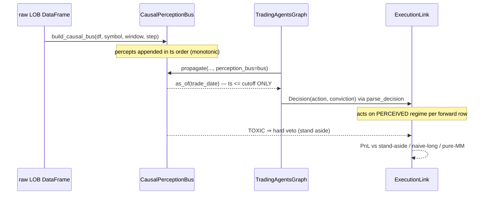

# How Kairos Works — a Hands-On Walkthrough

Kairos is a dual-process trading brain. **System 1** (`kairos.perception`, LOB-Core)
reads limit-order-book microstructure fast and subsymbolically; **System 2**
(`kairos.reasoning`, TradingAgents) reasons slowly with a multi-agent LLM firm.
The two are joined causally by **the bridge** (`kairos.bridge`), whose
`CausalPerceptionBus` makes look-ahead bias impossible *by construction* rather
than by review.

This document is a practical walkthrough: install, then four worked examples,
every snippet grounded in the real API.

```mermaid
flowchart LR
    subgraph S1["System 1 — Perception (LOB-Core)"]
        LOB[raw book window] --> P["Percept<br/>regime · flow · toxicity · direction"]
    end
    P -->|record| BUS["CausalPerceptionBus<br/>append-only · as_of(cutoff)"]
    BUS -->|point-in-time read| S2
    subgraph S2["System 2 — Reasoning (TradingAgents)"]
        S2["analysts → bull/bear debate<br/>→ trader → risk → PM"] --> DEC["Decision<br/>BUY/HOLD/SELL + conviction"]
    end
    DEC --> EX["ExecutionLink<br/>DirectionalMaker (Avellaneda–Stoikov)"]
    P -.->|HARD VETO on TOXIC| EX
    EX --> PNL["PnL vs honest baselines"]
```

---

## 1. Installation

Kairos ships as one package with a small always-on core and opt-in extras. The
**core** — `numpy`, `pandas`, `scikit-learn` — gives you perception inference,
the causal bridge, execution, and the cognitive loop in *deterministic* mode.
No API keys, no MLX, runs anywhere including CI.

```bash
# from the repo root
python -m venv .venv && source .venv/bin/activate
pip install -e .                    # core only — the deterministic loop runs now
```

Extras (declared in `pyproject.toml` under `[project.optional-dependencies]`):

```bash
pip install -e '.[reasoning]'       # System-2: langchain + langgraph + data providers
pip install -e '.[mlx]'             # System-1 training backend (Apple Silicon; inference has a numpy fallback)
pip install -e '.[native]'          # zero-copy C++ ring via pybind11
pip install -e '.[viz]'             # matplotlib charts / heatmaps
pip install -e '.[bedrock]'         # Amazon Bedrock provider for System-2
pip install -e '.[all]'             # reasoning + native + viz + bedrock (everything except the platform-specific mlx backend)
```

The console entry point is `kairos` (`[project.scripts] kairos = "kairos.cli:main"`):

```
kairos version
kairos loop      [--scenario toxic|calm|range] [--mode deterministic|llm] [--steps N]
kairos perceive  <gen|train|cluster|backtest|...>   # System-1 subcommands
kairos reason    <TICKER> <YYYY-MM-DD>              # System-2 — needs [reasoning]
kairos web       [--live] [--port N]
kairos soul-check                                   # the unified Constitution enforcer
kairos reproduce                                    # end-to-end reproducibility gate
```

`loop` is the flagship. `reason` and `--mode llm` are the only paths that need
the `[reasoning]` extra; everything else runs on the core install.

---

## 2. `kairos loop --scenario toxic` — and reading the reflection

The loop (`kairos.loop.cognitive_loop.run_cognitive_loop`) runs one full
**perceive → reason → act → reflect** cycle:

1. **Perceive** — generate/replay a synthetic session into a strictly-causal
   `CausalPerceptionBus` (System-1).
2. **Reason** — at the decision instant, form a `Decision` (BUY/HOLD/SELL +
   conviction). In `deterministic` mode a transparent stand-in policy; in `llm`
   mode the real TradingAgents debate.
3. **Act** — execute that stance over the *forward* window via `ExecutionLink`,
   where System-1 keeps a **hard TOXIC veto**.
4. **Reflect** — score against honest baselines (stand-aside, naive-always-long,
   pure market-making).

Run it:

```bash
kairos loop --scenario toxic
```

The session is split by `decision_fraction` (default `0.5`): the decision is
formed from the **in-sample half only**, and execution runs on the **forward
half**. Look-ahead is impossible by construction, so the reported PnL is a
faithful causal shadow, never an inflated backtest.

### Interpreting the reflection

The human-readable block is built by `_reflect(...)`. A representative run of
`--scenario toxic` prints:

```
Kairos cognitive loop — BTCUSDT (scenario=toxic, mode=deterministic)
  System-1 percept : TREND / BULL (conf 100%, tox 0.10)
  System-2 stance  : BUY @ conviction 0.67 (source=deterministic-policy)
  Execution        : PnL +464.5, 207 fills, inv +7.59, halted=False
  System-1 veto    : 28% of the window perceived TOXIC (dominated=False)
  Edge vs stand-aside: +464.5
  Baselines        : stand_aside=+0, naive_long=+1032, pure_market_making=-1083
```

> **Read this honestly.** On this *trending* toxic scenario the loop earns
> +464.5, so it beats standing flat aside (its edge over doing nothing is
> +464.5) but **not** naive-always-long (+1032): the market trends up, so pure
> directional exposure wins, and a market maker pays adverse selection. That is a property of a trending market, not a bug. Kairos's
> measured edge is on **benign (range) markets** — run `--scenario range` and
> the loop captures spread (~+850) while naive-long earns almost nothing (~+80),
> across every seed. The value here is *regime-adaptivity and causal safety*, not
> a promise of profit in every regime. `scripts/reproduce.py` encodes exactly
> this honest claim.

Line by line:

- **System-1 percept** — the point-in-time read at the decision instant:
  `percept.regime_name` / `percept.direction`, with `regime_confidence` and
  `toxicity`. This is `bus.as_of(decision_ts)` — nothing after the cutoff was
  visible.
- **System-2 stance** — the `Decision.action` and `conviction`, plus its
  `source`. In deterministic mode `deterministic_policy` maps the percept to a
  stance: `conviction = direction_strength * regime_confidence`, and it returns
  `HOLD` outright if `percept.is_toxic`.
- **Execution** — `final_pnl`, `fills`, `final_inventory`, and whether the
  `RiskGate` `halted`. Execution acts on the *perceived* regime per forward row
  (`perceive_regimes`), never the ground-truth label.
- **System-1 veto** — `neuro_symbolic.toxic_veto_fraction`: the fraction of the
  forward window perceived TOXIC, where the `DirectionalMaker` stood aside.
  `dominated` is `True` only if the window was majority-TOXIC (System-1
  overrode System-2 outright).
- **Edge vs stand-aside** — `pnl - baselines["stand_aside"]["final_pnl"]`; the
  measured value of acting at all.
- **Baselines** — final PnL of three honest reference strategies scored over the
  *same* forward window.

If the percept is TOXIC and the stance is HOLD, the loop appends the
dual-process win line: *System-1 flagged phantom liquidity; System-2 stood
aside.*

For machine-readable output add `--json` — this dumps `LoopResult.to_dict()`
(the full percept, decision, execution annotations, and baselines):

```bash
kairos loop --scenario toxic --json
```

You can also drive the loop directly, which is the honest way to test invariants
in code:

```python
from kairos.loop import LoopConfig, run_cognitive_loop

cfg = LoopConfig(symbol="BTCUSDT", scenario="toxic", n_steps=4000, seed=7,
                 mode="deterministic", decision_fraction=0.5)
result = run_cognitive_loop(cfg)

print(result.reflection)
print(result.percept.regime_name, result.percept.direction)
print(result.decision.action, result.decision.conviction)
print(result.execution["final_pnl"], result.execution["neuro_symbolic"]["toxic_veto_fraction"])

# The causal invariant the loop itself asserts:
assert result.percept.ts <= result.decision_ts
```

`LoopConfig` also exposes `--learned` (CLI) / `regime_backend` (API): pass a
`kairos.bridge.LearnedRegime` wrapping the trained VICReg encoder to swap the
heuristic regime read for the learned one.

---

## 3. Building a `CausalPerceptionBus` from a DataFrame and querying `as_of`

The bus is the anti-look-ahead heart of Kairos. You rarely construct percepts by
hand — `build_causal_bus` replays a raw LOB DataFrame into a bus, emitting one
`Percept` every `step` rows, each aggregated over a **trailing** `window` of
rows (so each percept sees only its own past).

```python
from kairos.bridge import build_causal_bus
from kairos.perception.synthetic.generate import generate

# Any DataFrame with a `ts` column works; here we synthesize a session.
df = generate(n_steps=2000, seed=7, scenario="toxic")

bus = build_causal_bus(df, symbol="BTCUSDT", window=64, step=8)
print(bus)
# CausalPerceptionBus(n=250, ts_span=[<first_ts>, <last_ts>], strict=True)
```

`build_causal_bus` takes the per-percept timestamp from each window's last row's
`ts` column (or you can override wall-clock via the `timestamps=` argument). It
appends in timestamp order; the bus rejects any out-of-order `record`, because a
real feed never delivers an older book after a newer one.

### The only causal read: `as_of`

`as_of(cutoff)` is the **only** sanctioned way System-2 reads perception. It
does a `bisect_right` and can reach **only** percepts with `ts <= cutoff`:

```python
mid_ts = float(df.iloc[len(df) // 2]["ts"])

p = bus.as_of(mid_ts)          # most recent percept at or before the cutoff
print(p.to_prompt())           # the compact, deterministic, LLM-facing summary
assert p is None or p.ts <= mid_ts   # never the future — asserted inside the bus too
```

Two invariants make this a guarantee, not a convention (both asserted at runtime
and property-tested in `tests/bridge/test_causal_bus.py`):

1. **No future access** — every percept any query returns has `ts <= cutoff`. A
   violation raises `LookAheadError` (a bug in the bus, never a mere data gap —
   an empty history simply returns `None`).
2. **Append-independence** — recording later percepts never changes the answer
   to an earlier `as_of`. The past is immutable once observed:

```python
answer_before = bus.as_of(mid_ts)

# Append the whole *future* of the session, then re-query the same cutoff.
future = generate(n_steps=2000, seed=7, scenario="toxic").iloc[len(df):]
# (in practice you extend with genuinely later percepts; illustrative here)
answer_after = bus.as_of(mid_ts)

assert answer_after is answer_before   # the past did not move
```

**Date-string cutoffs.** `to_epoch` normalises the query time onto the bus's
clock. Critically, a bare `"YYYY-MM-DD"` maps to the **close** of that calendar
day (UTC) — the whole trading day is in-sample — *not* midnight. This is
deliberate: `datetime.fromisoformat("2024-05-10")` parses to midnight on Python
3.11+, which would silently turn a close-of-day cutoff into a start-of-day one
and reintroduce intraday look-ahead. Kairos detects the date-only form first
and pins it to `23:59:59.999999Z`:

```python
from kairos.bridge import to_epoch

to_epoch("2024-05-10")        # close of 2024-05-10 UTC (whole day in-sample)
to_epoch(1_715_000_000.0)     # int/float passed through (synthetic / monotonic clock)
to_epoch("2024-05-10T14:30")  # datetime with a time component → that exact UTC epoch
```

Richer causal reads exist on the same boundary — all strictly `<= cutoff`:

```python
recent = bus.window_before(mid_ts, n=32)          # up to 32 percepts, oldest→newest
agg    = bus.aggregate_before(mid_ts, horizon=500)  # regime distribution + mean flow over (cutoff-horizon, cutoff]
print(agg["dominant_regime"], agg["toxic_fraction"])
```

> Constitution note: `.latest` and `._percepts` are non-causal accessors.
> Rule 5 of `scripts/soul_check.py` forbids the *reasoning-facing* bridge from
> touching them — System-2 must go through `as_of` / `window_before` /
> `aggregate_before`.

---

## 4. Deterministic vs LLM modes

The two modes differ **only** in how the `Decision` (stance) is formed; the
perceive, act, and reflect stages are identical. This is what makes the LLM mode
honestly comparable to the deterministic stand-in.

| | `deterministic` | `llm` |
|---|---|---|
| Stance source | `deterministic_policy(percept)` | real TradingAgents multi-agent debate |
| Dependencies | core install only | requires `[reasoning]` + API keys |
| Determinism | fully reproducible | model-dependent |
| Reads System-1 | directly, via `as_of` | via the Microstructure Analyst's tools, from the attached bus |

**Deterministic** — a transparent, auditable System-2 stand-in
(`deterministic_policy`): HOLD if `percept.is_toxic`; otherwise BUY/SELL along
`percept.direction` sized by `direction_strength * regime_confidence`. It exists
so the whole loop runs with no LLM and so the LLM path has an honest baseline to
beat.

```bash
kairos loop --scenario toxic --mode deterministic
```

**LLM** — the real debate. Internally (`_llm_decision`) the loop builds a
`TradingAgentsGraph` with the Microstructure Analyst included and **attaches the
causal bus** so every microstructure tool reads point-in-time:

```python
ta = TradingAgentsGraph(
    selected_analysts=("microstructure", "market", "news", "fundamentals"),
    config=cfg,
)
final_state, decision_text = ta.propagate(
    symbol, decision_date, asset_type="crypto", perception_bus=bus,
)
decision = parse_decision(str(decision_text))   # → Decision(action, conviction, ...)
```

`parse_decision` extracts the stance from the free-text verdict — it prefers the
explicit `FINAL TRANSACTION PROPOSAL: **BUY/HOLD/SELL**` marker the pipeline
emits, falls back to the last bare BUY/HOLD/SELL token, then to a 5-tier tilt
word (`Overweight` → BUY, `Underweight` → SELL, at a reduced conviction), and
reads conviction from an optional `x/5`, `x/10`, `x/100`, or `x%` rating.

Run it (needs `[reasoning]` and a configured provider key):

```bash
pip install -e '.[reasoning]'
export ANTHROPIC_API_KEY=...        # or the provider your config selects
kairos loop --scenario toxic --mode llm
```

You can also pass a custom reasoning config through the API:

```python
from kairos.loop import LoopConfig, run_cognitive_loop
from kairos.reasoning.default_config import DEFAULT_CONFIG

cfg = LoopConfig(scenario="toxic", mode="llm")
result = run_cognitive_loop(cfg, reasoning_config=DEFAULT_CONFIG.copy())
```

---

## 5. Attaching a bus to a real TradingAgents run via `propagate(perception_bus=...)`

Outside the loop, you can wire the causal bus into a standalone TradingAgents run
directly. `TradingAgentsGraph.propagate` accepts an optional `perception_bus`;
when supplied, it registers the bus for this run's Microstructure Analyst tools
(`set_perception_bus(perception_bus, symbol=company_name)`), which then read
System-1 percepts **strictly point-in-time as of `trade_date`** — never the
future. This is exactly what closes TradingAgents' native look-ahead hole.

```python
from kairos.bridge import build_causal_bus
from kairos.perception.synthetic.generate import generate
from kairos.reasoning.default_config import DEFAULT_CONFIG
from kairos.reasoning.graph.trading_graph import TradingAgentsGraph

# 1) Build the strictly-causal perception history for the symbol.
df  = generate(n_steps=4000, seed=7, scenario="toxic")
bus = build_causal_bus(df, symbol="BTCUSDT", window=64, step=8)

# 2) Include the Microstructure Analyst so the run actually consults System-1.
ta = TradingAgentsGraph(
    selected_analysts=("microstructure", "market", "news", "fundamentals"),
    config=DEFAULT_CONFIG.copy(),
)

# 3) Attach the bus. The analyst's tools now read as_of(trade_date) only.
final_state, decision = ta.propagate(
    "BTCUSDT", "2024-05-10", asset_type="crypto", perception_bus=bus,
)
print(decision)
```

Key points:

- The `perception_bus` argument is **optional**. Omit it and TradingAgents runs
  as before (with its native look-ahead exposure). Supply it and the
  Microstructure Analyst is fed a strictly-causal view.
- `trade_date` as `"2024-05-10"` maps, via `to_epoch`, to the **close** of that
  day — the whole trading day is in-sample, and nothing after it is reachable.
- The bus must already contain percepts with `ts <= to_epoch(trade_date)` for
  the analyst to have anything to read; otherwise `as_of` returns `None` and the
  analyst reports an empty causal history (never an error, never the future).
- To turn the free-text verdict into an executable `Decision`, feed it through
  `parse_decision` (see §4), then hand it to `ExecutionLink.execute(...)` to
  simulate fills over a forward window — where System-1's TOXIC veto still
  applies.

---

## Where the causal seam lives



The one rule that makes all of this trustworthy: perception can be read by
System-2 **only** through the bus, and the bus can reach **only** the past.
Look-ahead bias is not something Kairos audits for — it is something the
architecture cannot express.
