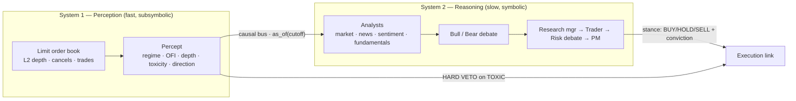
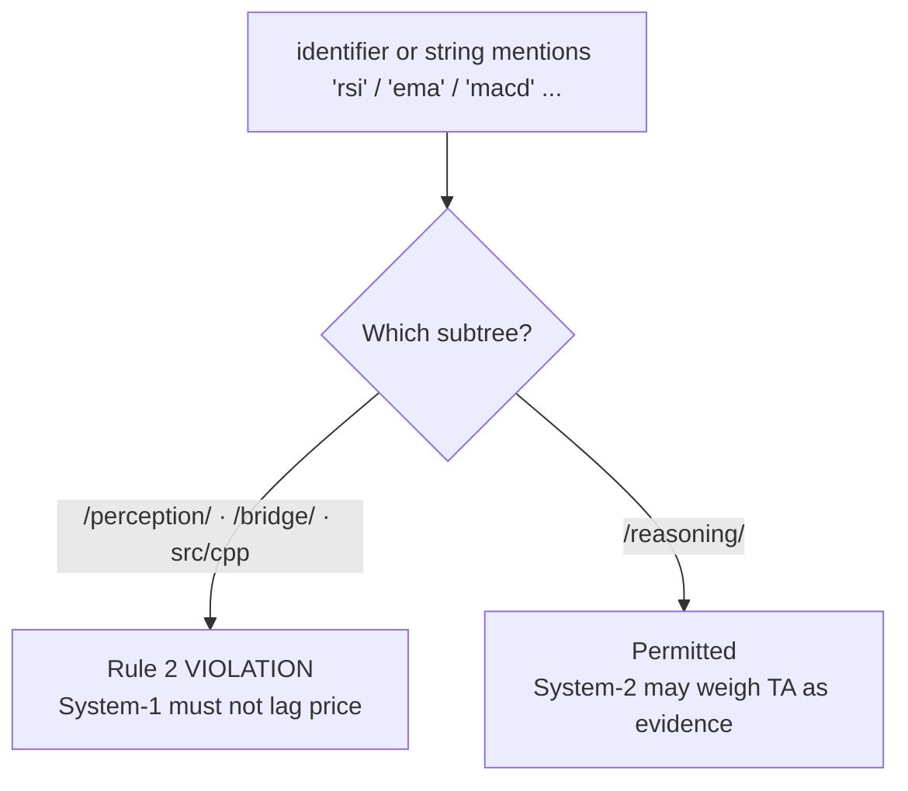

# The Philosophy of Kairos

> Two systems, two souls, one veto.

Kairos is not one trading model with a philosophy bolted on. It is *two*
cognitive systems, deliberately built to disagree about what knowing a market
even means — and a constitution (`scripts/soul_check.py`) that keeps their
disagreement honest by enforcing each one's soul separately.

This document states the thesis, grounds every claim in the actual code, and
explains four load-bearing design decisions:

1. Why markets warrant a **dual-process** (Kahneman System 1 / System 2) mind.
2. Why the two systems have **different souls** — one forbidden classic TA, one
   permitted it.
3. Why the fast system holds a **hard veto** over the slow one.
4. Why the fast system is **label-free** — regime is evaluation-only, never a
   target.

---

## 1. Dual process, applied to markets

Kahneman's *Thinking, Fast and Slow* splits cognition into two systems:

* **System 1** — fast, automatic, subsymbolic, always-on, effortless. It
  *perceives*. It does not argue; it reacts.
* **System 2** — slow, deliberate, symbolic, effortful, serial. It *reasons*.
  It weighs evidence, constructs narratives, and can be wrong in articulate ways.

A market presents exactly this bifurcation. There is a fast, structural truth in
the limit order book — who is resting size where, who is lifting offers, whether
the visible depth is real or spoofed — that lives on a millisecond clock and
carries no story. And there is a slow, contested truth — earnings, sentiment,
macro, the *narrative* — that lives on a daily clock and is nothing *but* story.

Kairos maps these to two subsystems:

| | System 1 — Perception | System 2 — Reasoning |
|---|---|---|
| Module | `src/kairos/perception/` (LOB-Core) | `src/kairos/reasoning/` (TradingAgents) |
| Substance | self-supervised LOB microstructure | multi-agent LLM debate on LangGraph |
| Clock | per-snapshot / per-row | per trade-day |
| Output | a `Percept` (regime, flow, depth, toxicity, direction) | a stance (BUY/HOLD/SELL + conviction) |
| Epistemics | "Don't predict, understand." | "Deliberate over fallible evidence." |
| Failure mode | silent, structural | articulate, narrative |

The atom that crosses the boundary is the **`Percept`**
(`src/kairos/bridge/percept.py`): an immutable, point-in-time System-1 reading.
Its module docstring states the division of labour precisely — System 1
*produces* Percepts ("fast, subsymbolic, self-supervised readings of the
limit-order-book"), System 2 *consumes* them ("slow, symbolic, deliberative
multi-agent reasoning").

Critically, a `Percept` reports **state, not forecast**. `Percept.to_prompt()`
is "deliberately free of price *forecasts*: it reports the *state* of the book
(regime, flow, depth, toxicity), never a predicted return — the System-2 agents
form the directional view themselves." The fast system hands the slow system a
*description of now*, and refuses to do the slow system's job of guessing what
comes next.

---

## 2. Two souls: why one system is forbidden TA and the other is not

The most counter-intuitive design choice in Kairos is that its constitution is
**scoped**. The same repo forbids a class of reasoning in one subtree and
explicitly *permits* it in another. This is not inconsistency; it is the whole
point.

`scripts/soul_check.py` says so in its own header:

> Kairos fuses two systems with *deliberately different* souls, so the
> constitution is **scoped**.

### System 1's soul: "Don't predict, understand."

The perception engine (`src/kairos/perception`, `src/kairos/bridge`, the C++
ring) is forbidden the vocabulary of classic price-lagged technical analysis.
`soul_check.py` Rule 2 enforces this with a banned-token set —
`rsi, macd, bollinger, stochastic, ichimoku, adx, obv, mfi, cci, vwap, twap,
ema, sma, wma, ...` — matched against sub-tokenised identifiers *and* strings in
every engine file, plus banned phrases like `moving average` and
`relative strength`.

Why forbid them? Because a moving average, an RSI, a MACD are all **functions of
past price** — they are lagged transforms of the very series you are trying to
understand. They smuggle a prediction (the trend will continue, the oscillator
will revert) into what pretends to be a measurement. They are, epistemically,
System-2 reasoning wearing a System-1 costume.

System 1's job is to *understand the current state of the book*, not to
extrapolate the tape. So the data contract (`src/kairos/perception/schema.py`)
admits **only raw L2 depth, cancel-flow and trade-tick fields** — its docstring:

> Rule 2 (no classic analysis): only raw L2 depth, cancel-flow and trade-tick
> fields are defined here. There is intentionally no smoothed, trend-following
> or oscillator-style field anywhere in the contract.

The `Snapshot` dataclass carries `bid_px/bid_sz/ask_px/ask_sz` (resting depth),
`bid_cxl/ask_cxl` (cancellations — the fingerprint of spoofing), and
`trade_buy/trade_sell/trade_n` (aggressive flow). No smoothed anything. The
`Percept` then distils these into dimensionless, cross-instrument reads:
`order_flow_imbalance`, `depth_imbalance`, `toxicity`, `trade_intensity`. Every
one is a statement about *what the book is right now*, not what price will do.

### System 2's soul: deliberate over fallible evidence — including TA.

The reasoning firm (`src/kairos/reasoning`) is **intentionally exempt**.
`soul_check.py` in `is_reasoning()` / `is_engine()` carves the `/reasoning/`
subtree out of the engine rules entirely, and the header is explicit:

> **System 2 — the reasoning firm**: a multi-agent LLM that *may* reason about
> RSI/MACD/etc. as fallible evidence among many. It is intentionally EXEMPT from
> the no-classic-TA rule — that is its design.

This is coherent because of *how* System 2 uses an indicator. A human analyst
who says "RSI is oversold, but the news flow is deteriorating and the bull case
rests on a buyback that may be cancelled" is not treating RSI as truth — she is
treating it as one fallible witness in a debate. That is precisely the
TradingAgents structure: analysts → bull/bear debate → research manager → trader
→ risk debate → portfolio manager. An indicator entering that machinery is
cross-examined, contradicted, and out-voted. It is *evidence under adversarial
review*, not a signal wired to a trade.

So the same token `rsi` is a constitutional violation in `perception/` and a
legitimate analytical input in `reasoning/`. The soul check knows the
difference because it knows *which cognitive system it is standing in*.

---

## 3. The fast system's veto: TOXIC stand-aside

In a dual-process mind, System 1 can *override* System 2 reflexively — you yank
your hand off a hot stove before you have finished forming the sentence "that is
hot." Kairos gives its fast system the same authority, and it is the sharpest
edge of the whole design.

The execution link (`src/kairos/bridge/execution_link.py`) states the ordering
in its module docstring:

> * **System 2** sets the *stance*: BUY / HOLD / SELL and a conviction in [0, 1].
>   It is smart but slow, and it cannot see the book.
> * **System 1** *executes* that stance passively ... and retains a **hard
>   veto**: in a TOXIC (spoofed / phantom-liquidity) regime it stands aside no
>   matter how convinced System-2 is. A reflexive, fast safety reflex overrides
>   deliberation, exactly as in a dual-process mind.

The mechanism is not a suggestion — it is structural. `TOXIC` (in
`schema.py`) is the regime where a spoofer floods and cancels phantom depth: the
book *looks* liquid but the liquidity is illusory. `Percept.is_toxic` names it
"System-1's hard veto." A slow, narrative-driven System-2 has no way to see
this — it "cannot see the book." Deliberation over yesterday's news is exactly
the wrong tool against a spoofer operating on a microsecond clock.

So authority inverts. `DirectionalMaker` (an Avellaneda–Stoikov maker skewed by
System-2's `bias`) preserves the base maker's regime overlay **intact** — its
docstring: "TOXIC → no quote, TREND → reduce-only, so System-1's vetoes always
win; the bias only re-sizes the two legs when the maker is otherwise willing to
quote." System-2's conviction can *size* a trade; it can never *force* one into a
market System-1 has judged to be a trap.

And the veto is applied to the **perceived** regime, not ground truth — see §4
and `perceive_regimes()`, which computes a fresh regime per row from a trailing
causal window. The reported `neuro_symbolic` block records `toxic_veto_fraction`
and flags `system1_vetoed` when the fast system dominated the window. In the
demonstrated deterministic run, System-1 vetoed 28% of the window as TOXIC while
still letting a BUY conviction of 0.67 through the rest — the two systems
cooperating, with the fast one holding the emergency brake.

The asymmetry is deliberate: **System 2 proposes; System 1 disposes on safety.**
The slow system is granted the right to be clever. The fast system is granted the
right to say *no* — and its no is final.

---

## 4. Label-free: regime is evaluation-only

The last pillar is epistemic hygiene, and it too is enforced by the
constitution. System 1's regimes — `RANGE / TREND / TOXIC` — are **never a
training target**. They exist only to *measure* the engine after the fact, never
to *supervise* it.

`Regime` in `schema.py` is annotated at the type level:

> Ground-truth market regime — EVALUATION ONLY (never a training target).

and the module's Rule 4 note:

> Rule 4 (label-free learning): a `regime` column exists ONLY as ground-truth
> for *evaluation / visualisation*. It is never part of the feature matrix and
> must never enter a training loss.

`soul_check.py` Rule 4 backs this with a scan of model/strategy code: if a file
mentions `regime` alongside `cross_entropy`, `labels=`, `y_true`,
`softmax_cross`, or `classification`, it is flagged — a ground-truth regime used
as a supervised target is a constitutional violation.

Why refuse the labels you already have? Two reasons, both central to "don't
predict, understand":

1. **A label is a prediction in disguise.** If you train the encoder to output
   "TREND", you have decided in advance what the categories of market truth are
   and pinned the model to your taxonomy. The self-supervised VICReg encoder
   instead learns the *geometry* of book states with no target, and regimes are
   read off that geometry afterward. Understanding is discovered, not decreed.
2. **Ground-truth regime is not available live.** In production there is no
   oracle stamping each snapshot RANGE/TREND/TOXIC. A model that depended on the
   label would be un-shippable. So execution acts on the **perceived** regime —
   `perceive_regimes()` recomputes it per row from a causal window, and
   `execution_link` overwrites `df2["regime"]` with that perceived value: "This
   is what execution acts on — the same System-1 read the reasoning layer saw,
   never the ground-truth `regime` column." The backtest is thereby "a faithful
   shadow of live trading," not a lookahead-contaminated fantasy.

The label survives *only* as a scorecard: it lets us ask "did the label-free
engine recover the true regimes?" without ever letting the answer leak into how
the engine was built.

---

## 5. The seam is causal by construction

The two souls only compose safely because the seam between them cannot leak the
future. This is Rule 5, the Kairos-specific clause of the constitution, and it
guards the one direction of contamination the whole architecture exists to
prevent.

System-2 reads System-1 **only** through the causal bus. Percept fields are, by
the `percept.py` contract, "computable from information available **at or
before** the percept's timestamp" — no field peeks at a future price. That local
guarantee is lifted to a global one by `CausalPerceptionBus.as_of(cutoff)`:
the reasoning layer can reach only percepts with `ts <= cutoff`.

`soul_check.py` Rule 5 enforces this at the source level. In the
reasoning-facing bridge files (`microstructure_tools.py`,
`microstructure_analyst.py`), touching the non-causal accessors `.latest`,
`._percepts`, or `._ts` is a **violation** — because a *dated* query that
reaches into raw storage could resolve to a *future* percept, reopening "the
exact look-ahead hole Kairos exists to close." The reasoning bridge may use
`as_of` / `window_before` / `aggregate_before` and nothing else.

This is why the split into two souls is not merely a stylistic conceit. A slow,
articulate System-2 is exactly the kind of reasoner that will, given the chance,
rationalise a peek at the future into a plausible story. Rule 5 removes the
chance. System 2 gets to be as clever and as fallible as it likes — over a
strictly past-bounded view of what System 1 perceived.

---

## Summary

Kairos is a wager that a trading mind should be **two** minds:

* a fast one that **understands the book and never predicts from lagged price**
  (Rule 2, label-free Rule 4),
* a slow one that **deliberates over fallible evidence, TA included** (exempt by
  design),
* joined by a seam that is **causal by construction** (Rule 5, the causal bus),
* with the fast one holding a **hard, final veto** when the market turns toxic.

The constitution in `scripts/soul_check.py` does not paper over the difference
between the two systems — it *encodes* it, rule by rule, subtree by subtree. Two
souls, kept honest. That is the philosophy of Kairos.
